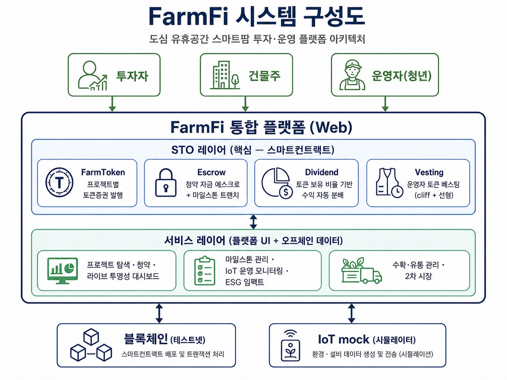

<div align="center">

# FarmFi (팜피)

도심 유휴공간을 스마트팜 기반 24시간 신선매장으로 전환하고, 운영자 모집·생육 모니터링·재고-판매 연동·성과관리를 제공하는 **공실전환 창업 지원 인프라**

*제7회 PNU 창의융합AI해커톤*

</div>

---

## 목차
1. [프로젝트 소개](#1-프로젝트-소개)
2. [상세설계](#2-상세설계)
3. [개발결과](#3-개발결과)
4. [설치 및 사용 방법](#4-설치-및-사용-방법)
5. [소개 및 시연 영상](#5-소개-및-시연-영상)
6. [팀 소개](#6-팀-소개)
7. [해커톤 참여 후기](#7-해커톤-참여-후기)

---

### 1. 프로젝트 소개

#### 1.1. 개발배경 및 필요성

- **도심 공실은 사람이 없어서가 아니라, 돈을 쓸 업종이 없어서 생겼다**
  - 2024년 2분기 기준 부산대 앞 상권 공실률 약 23.4%, 부산 중대형 상가 공실률 15.3%로 서울(9.3%) 대비 약 1.6배 (한국부동산원, 상업용부동산 임대동향조사)
  - 주력 업종(보세 의류·액세서리 등)이 온라인으로 대체되며 오프라인 매장의 존재 이유가 사라진 것이 핵심 원인. 유동인구가 아니라 **반복적으로 돈을 쓸 업종**이 사라졌다.

- **신선 식품은 온라인이 대체하지 못하는 영역이다**
  - "지금·여기서·조금만·신선하게" 수요는 오프라인에서만 충족된다. 1인가구 35.5%(2023), 소포장·근거리 신선식품 수요는 구조적 순풍.
  - 스마트팜은 LED로 24시간 가동되므로, 무인 판매를 결합하면 추가 인건비 없이 24시간 초신선 매장이 가능하다 — 공실과 즉시 신선 수요를 동시에 푸는 열쇠.

- **그러나 스마트팜 창업의 진입장벽은 높다**
  - 공간 진단(전기·급배수·층고), 초기 설비비, 재배 기술, 운영자 확보까지 개인이 혼자 넘기 어렵다. 확산되려면 공간 선별·설비 연결·운영자 배정·재배 지원을 잇는 **실행 구조**가 필요하다.

#### 1.2. 개발 목표 및 주요 내용

FarmFi는 스마트팜을 직접 운영하는 회사가 아니라, 유휴공간을 신선매장으로 전환하려는 **기관**과 이를 운영할 **개인 운영자**를 연결하는 창업 지원 인프라다. 이번 산출물은 그 인프라의 **웹 운영 플랫폼 MVP**로, 세 계층의 기능을 검증한다.

| 계층 | 기능 |
|:---|:---|
| 모집·배정 | 공간 진단·등록, 운영자 모집·매칭(1공간 1운영자) |
| 운영 연동 | 생육 모니터링(온·습·CO₂·광량·pH), 생육 이상 알림, **재고-생육 연동('오늘 할 일')**, **판매-재배 연동** |
| 성과·확장 | **기관 성과 리포트**(공간활용·생산·판매·운영현황), 다지점 관리 |

> FarmFi의 정체성은 **재배(farm)와 판매(retail)를 한곳에서 연결**하는 것이다. 재고-생육 연동과 판매-재배 연동이 그 핵심이며, 재배만 보는 일반 스마트팜 SW·판매만 보는 일반 POS와 구분된다.

#### 1.3. 세부내용

| 사용자 | 니즈 | 핵심 기능 |
|:---|:---|:---|
| 기관·지자체 | 유휴공간을 실제 운영되는 신선매장으로 전환하고 공실전환 성과를 보고받고 싶다 | 기관 성과 리포트(공간활용률·생산량·판매·운영현황 집계) |
| 건물주 | 빈 상가를 부담 없이 활용하고 운영 현황을 확인하고 싶다 | 공간 등록·진단, 운영 현황 조회 |
| 운영자 | 초기자금 부담 없이 매장을 시작하고, 방문 시 뭘 해야 할지 알고 싶다 | 운영자 지원·배정, 생육 모니터링, '오늘 할 일'(수확·보충), 판매 입력·추이 |
| 플랫폼 관리자 | 지점 운영·생육 이상을 한눈에 보고 성과를 집계하고 싶다 | 이상 알림, 다지점 성과 집계 |

#### 1.4. 기존 서비스 대비 차별성

| 비교 항목 | 일반 스마트팜 SW | 일반 POS | **FarmFi** |
|:---|:---|:---|:---|
| 관리 대상 | 재배(환경 제어)만 | 판매만 | **재배 ↔ 판매 연결** |
| 무인매장 지원 | 약함 | 판매 기록만 | **재고-생육 연동 '오늘 할 일'** |
| 재배 조정 근거 | 없음 | 없음 | **판매 추이 → 증산/감축 추천** |
| 기관 보고 | 없음 | 없음 | **공실전환·생산·판매 성과 리포트** |

#### 1.5. 사회적가치 도입 계획

| 활용 영역 | 현재 상황 | FarmFi 연계 효과 |
|:---|:---|:---|
| 부산 원도심 공실 해소 | 중대형 상가 공실률 15.3% | 공실을 지속 운영되는 생산·판매형 공간으로 전환 |
| 중장년·청년 부업형 창업 | 초기비용·고정비 부담으로 창업 진입 어려움 | 설비·임대료 지원 전제 시 운영자 리스크를 운영비로 한정한 저리스크 창업 |
| 즉시 신선 식품 접근성 | 근거리 소량 신선식품 채널 부족 | 주거지 인접 24시간 초신선 매장 |
| 탄소 감축 데이터 | 수직농장 단위면적당 높은 효율 | IoT 데이터 축적 → 기관 ESG 리포트 근거 |

<br/>

### 2. 상세설계

#### 2.1. 시스템 구성도

<div align="center">

</div>

#### 2.2. 사용 기술

| 구분 | 기술 | 버전 |
|:---|:---|:---|
| 프론트엔드 | Next.js (App Router), TypeScript, Tailwind CSS | Next.js 14 |
| 백엔드 | Next.js API Routes, Prisma ORM, Supabase(PostgreSQL) | Prisma 7 |
| 인증 | 이메일 + 비밀번호 (bcrypt), jose 세션(JWT) | - |
| 이상 탐지 | Z-score + 도메인 정상범위 판정 (자체 구현, 수직농장 상추 문헌 기반) | - |
| 데이터 시각화 | Recharts | - |
| 배포 | Vercel | - |

<br/>

### 3. 개발결과

#### 3.1. 전체시스템 흐름도

```
[1] 공간 진단·선별 (전기·급배수·층고·입지)
        ↓
[2] 운영자 모집 → 1공간 1운영자 배정
        ↓
[3] 운영 개시 — 스마트팜 재배 + 24시간 무인 판매
        ↓
[4] 생육 모니터링 (센서 수집·시각화 + 이상 알림)
        ↓
[5] 재고-생육 연동('오늘 할 일') + 판매-재배 연동(추이→재배 조정)
        ↓
[6] 기관 성과 리포트 (공간활용·생산·판매·운영현황 집계)
```

#### 3.2. 기능설명

##### `랜딩 페이지`
- 공실전환 창업 지원 인프라 소개, 기관·건물주·운영자·설비 파트너별 진입 경로, 서비스 흐름 요약

##### `공간 등록 / 건물주`
- 유휴공간 등록(전기·급배수·채광·면적·모드), 스마트팜 적합도 산출, 내 공간 현황

##### `운영자 지원`
- 운영자 지원서 제출(희망 지역·재배 경험·운영 시간), 합류 절차 안내

##### `운영 대시보드`
- 실시간 IoT 환경(온·습·CO₂·광량), 생육 이상 감지·경고, ESG 임팩트, 온도 추이 차트

##### `오늘 할 일 · 판매-재배 · 기관 리포트` (API)
- 재고 상태 + 작물 성숙 시점 결합 수확/보충 대상, 품목별 판매 추이·재배 조정 근거, 기관 단위 성과 집계

#### 3.3. 기능명세서

주요 API 엔드포인트 (상세는 [docs/api-spec.md](docs/api-spec.md)):

| API | 메서드 | 설명 |
|:---|:---|:---|
| `/api/auth/signup`, `/api/auth/login`, `/api/auth/me` | POST/GET | 이메일+비밀번호 인증·세션 |
| `/api/spaces` | GET/POST | 유휴공간 등록·조회 |
| `/api/operator-applications` | POST | 운영자 지원 접수 |
| `/api/dashboard/[projectId]` | GET | 지점 대시보드(지점·IoT·ESG) |
| `/api/iot/generate` | POST | IoT 데이터 생성 + 이상 탐지·알림 적재 |
| `/api/ai/detect-anomaly` | POST | IoT 이상 탐지 |
| `/api/notifications` | GET | 생육 이상 알림 조회 |
| `/api/tasks/today` | GET | 재고-생육 연동 '오늘 할 일'(수확·보충) |
| `/api/sales`, `/api/sales/trend` | POST/GET | 판매 수기입력 · 품목별 판매 추이 |
| `/api/reports/institution` | GET | 기관 성과 리포트 집계 |

#### 3.4. 디렉토리 구조

```
├── frontend/               # Next.js 14 웹 앱 (UI + API Routes + Prisma)
│   └── prisma/             # 스키마 · 시드
├── docs/                   # 기획 문서 및 발표자료
└── README.md
```

#### 3.5. AI 도구 활용

**시스템 구성요소로서의 AI (단계적 도입):**

| AI 기능 | 내용 | 기대 효과 |
|:---|:---|:---|
| 생육 이상 탐지 | 센서 데이터 Z-score + 도메인 정상범위(수직농장 상추 문헌 기반) 판정 | 지속성 고장·스파이크 이상 조기 감지 |
| 판매-재배 최적화 | 품목별 판매 추이 분석 → 다음 재배 사이클 증산/감축 추천 | 안 팔리는 작물 과잉생산 방지 |
| 생육레시피·수확 예측 | 축적된 다지점 데이터 기반 최적 환경·수확 시점 도출 (확장) | 비전공 운영자 진입장벽 완화 |

**개발 생산성:** Claude Code(Opus)로 스키마 설계·API 구현·리팩터링·검증을 진행.

<br/>

### 4. 설치 및 사용 방법

**필요 소프트웨어:** Node.js 18+, Git

```bash
$ git clone https://github.com/PNU-2026-AI-Hackathon/pnuai-b-01-b301.git
$ cd pnuai-b-01-b301/frontend
$ npm install
$ cp .env.example .env          # DATABASE_URL, JWT_SECRET
$ npm run prisma:generate
$ npm run prisma:push           # DB 스키마 반영
$ npm run seed                  # v18 시드 (지점·품목·재고·수확·판매·IoT)
$ npm run dev                   # http://localhost:3000
```

**환경 변수 (.env):** 자세한 키 목록은 [CONTRIBUTING.md](CONTRIBUTING.md) 참고.

시드 로그인 계정: `operator@farmfi.test` / `admin@farmfi.test` (비밀번호 `farmfi123`)

<br/>

### 5. 소개 및 시연 영상

> 시연 영상은 개발 완료 후 추가 예정입니다.

<br/>

### 6. 팀 소개

| | 이정서 (팀장) | 조원진 | 우민성 | 박태정 |
|:---|:---:|:---:|:---:|:---:|
| **역할** | 기획 | 디자인 | 프론트엔드 | 백엔드 |
| **소속** | 경영학과 3학년 | 미디어커뮤니케이션학과 3학년 | 의생명융합공학부 데이터사이언스전공 4학년 | 정보컴퓨터공학부 인공지능전공 3학년 |
| **이메일** | 22z__zxs@naver.com | jwj11110@pusan.ac.kr | woominzang16@pusan.ac.kr | tj041600@naver.com |

<br/>

### 7. 해커톤 참여 후기

- **이정서**
  > 작성 예정

- **조원진**
  > 작성 예정

- **우민성**
  > 작성 예정

- **박태정**
  > 작성 예정

<br/>
